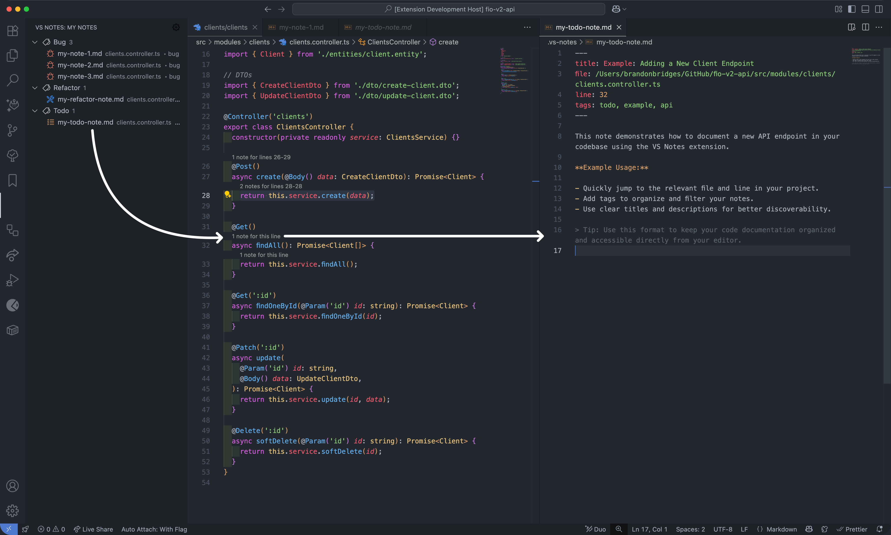

# VS Notebook

## Add a Notebook to your Project

VS Notebook is the quickest way to build a reliable notebook for your Project.

All notes are stored in `./vs-notebook` directory in your workspace so they can be easily shared with your team and safely committed to your version control system.

## Features

### Create a Note

Either select a line or a block of code and press `CMD + SHIFT + P` (or `CTRL + SHIFT + P` on Windows/Linux) to open the command palette, then type `Create Note`. This will create a new note in the `./vs-notebook` directory with the selected code snippet.

### Update/Delete a Note

To update or delete a Note, visit the sidebar view by clicking on the VS Notebook icon in the Activity Bar. You can select a note to view its content, and use the provided options to update or delete it.

## Requirements

No additional requirements are needed to use VS Notebook.

## Extension Settings

The VS Notebook extension contributes the following settings:

- `vsNotes.groupBy` - Group notes by `file` or `tag`.

## Known Issues

None (yet!).

## Release Notes

### 0.0.3

July 23, 2025

Updated the extension icon and sidebar icon to better reflect the extension's purpose.

### 0.0.1

July 23, 2025

Initial release of VS Notebook.

- Create notes from selected code snippets or lines
- View, update, and delete notes from the sidebar
- Tags for better organization
- Stored in the `./vs-notebook` directory
- Group notes by file or tag
- Version controlled and shareable
- Code Lens support to show the number of notes per line/block
